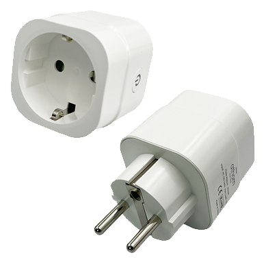
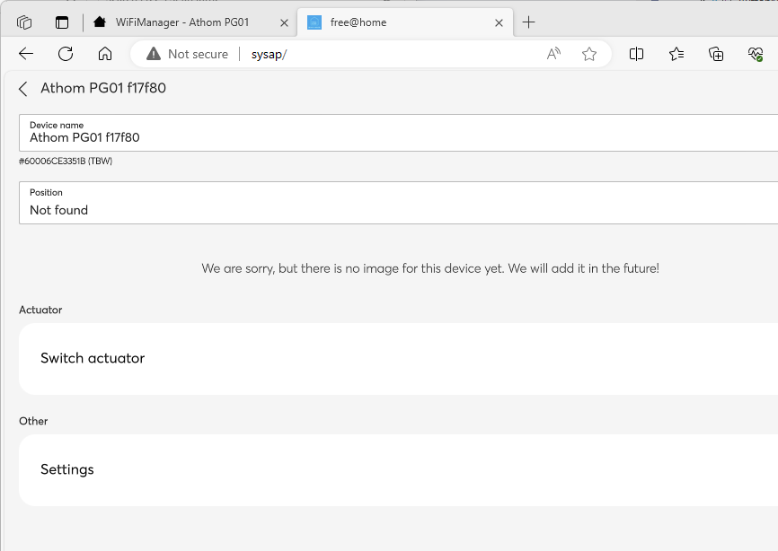
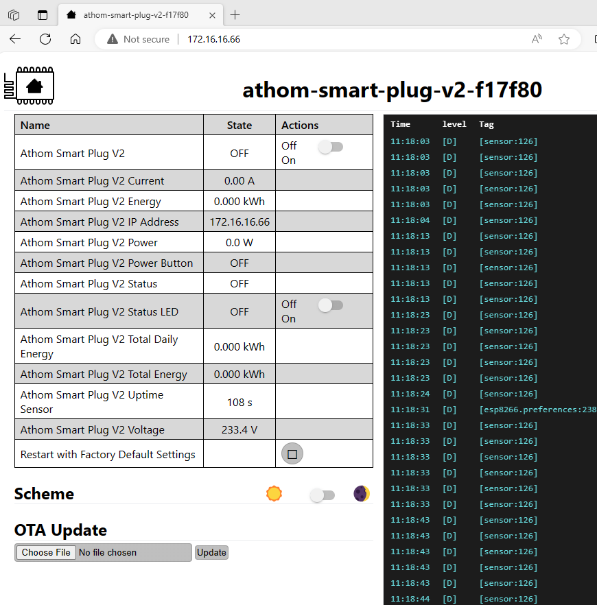
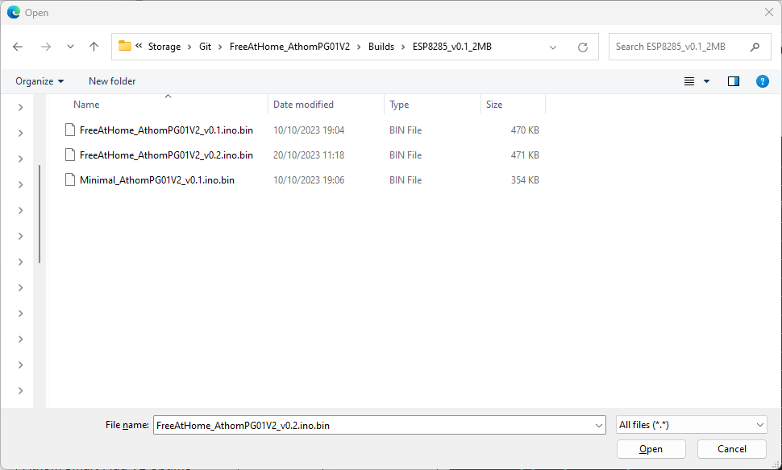
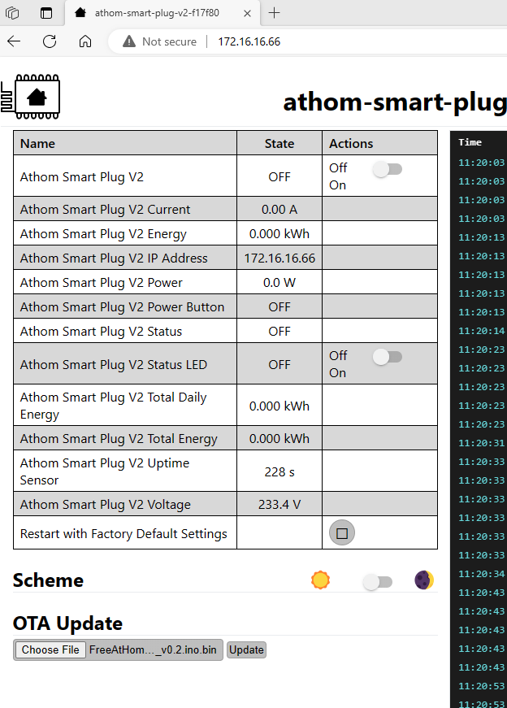
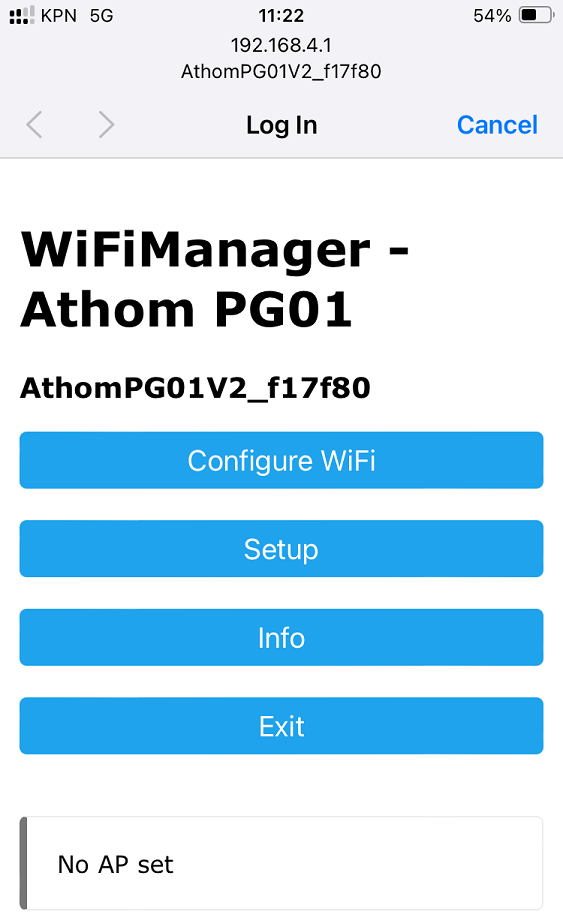
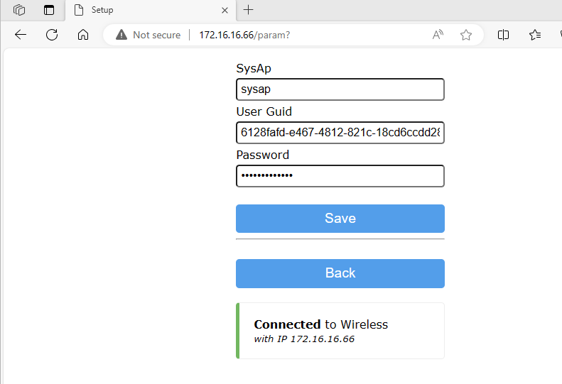
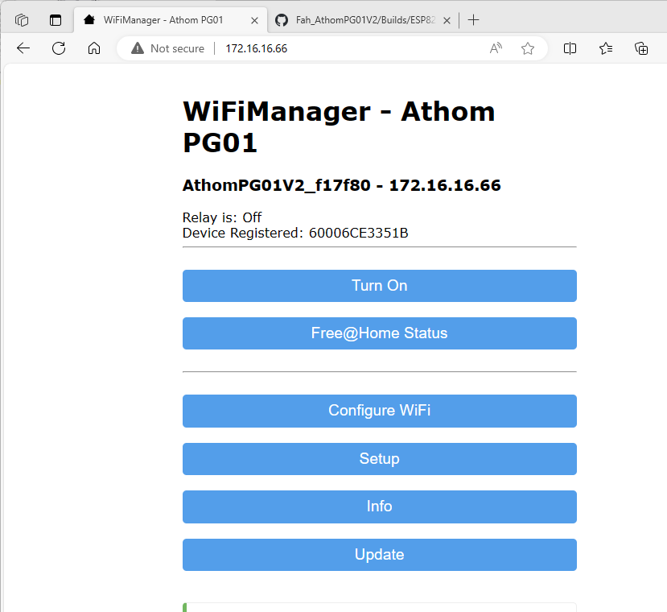

# FreeAtHome_AthomPG01V2

## About ##
AthomPG01V2 firmware to connect and control trough Free@Home. 
 
 

## Pre-requisites ##
- The Local API must be enable on the Free@Home system access point
- The supported device is the Athom Smartplug PG01 v2 preloaded with ESPHome https://www.athom.tech/blank-1/esphome-eu-plug
- The API uses a GUID instead of a username for authentication; retrieve the user GUID from:
http://sysap/swagger/users

## Notes ##
The firmware is only intended for the device detailed above. However, the procedure or any mistake during the procedure might leave the device in a unusable state. The device then must be reprogrammed using the serial interface after opening the case. 
 
The internal voltage and wattage sensors are currently implemented only for providing status information, they are not send to the SysAP in this version of the Firmware. 
 
***
THE CONTENT AND INSTRUCTIONS ARE PROVIDED “AS IS” WITHOUT WARRANTY OF ANY KIND, EITHER EXPRESS OR IMPLIED, INCLUDING, BUT NOT LIMITED TO, THE IMPLIED WARRANTIES OF MERCHANTABILITY AND FITNESS FOR A PARTICULAR PURPOSE. IT ALSO DOES NOT WARRANT THE ACCURACY OF THE INFORMATION IN THE CONTENT.
***
## Installation ##
To install the firmware to the Athom plug: 
 
- Download the latest release from: 
https://github.com/roelandkluit/Fah_AthomPG01V2/tree/main/Builds/ESP8285_2MB 
and store it on your system.

- Plug in the ESPHome Athom plug, configure the Wifi according to the ESPHome instructions.
- Open the ESPHome Athom plug's portal website once connected to the Wifi 
 

- Click the 'Choose File' button and select the firmware file 
 

- Select Update  
 

---
The plug will now reboot and be reset for usage with FreeAtHome 
---

- Connect to to Wifi Hotspot created by the Athom plug. The Wifi network name will start with AthomPG01V2 and end with the device ID
- A Wifi landing page will open, Configure the Wifi. 
 

- Upon successful configuration, the plug will reboot and connect to the configured Wifi. 
- Open the FreeAtHome Athom plug's portal website once connected to the Wifi, and click setup 
 
- Provide the System Accesspoint Hostname, username, and password for API access. Save these. 

- If the provided account is correct, the plug will connect to FreeAtHome and register itself. This can be validated on the portal website 
 
